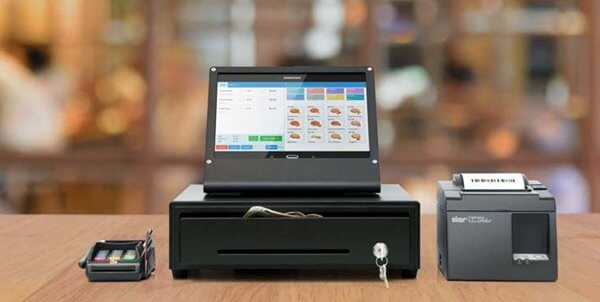
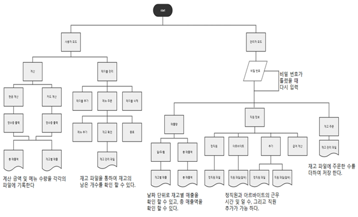
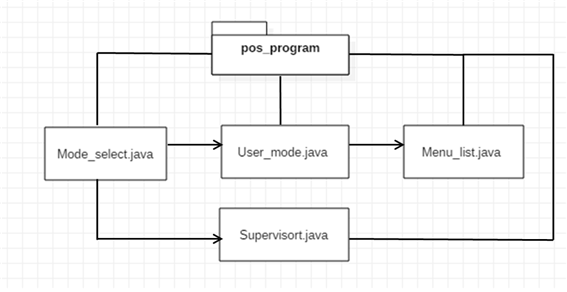
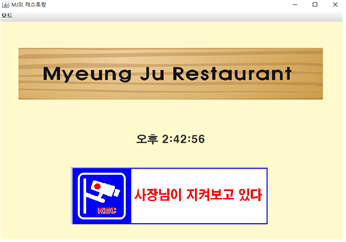
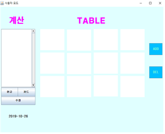
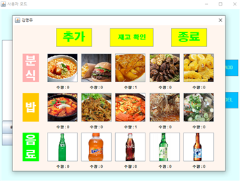
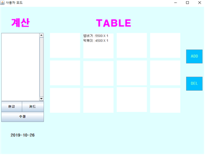
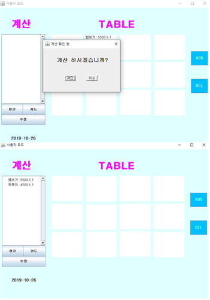
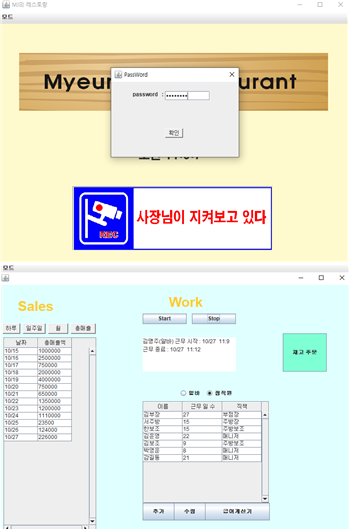

<h3 align="center">POS SYSTEM</h3>

## About The Project

 식당이나 가게, 슈퍼마켓 등에서 매출 계산, 재고 관리, 손님들의 주문 현황, 계산을 효율적으로 관리하기 위해서 전자적 방식으로 관리하는 POS 시스템을 자바로 구현한 것이다.
 사용자에게 기본 메뉴 제공(GUI), 테이블 별로 주문한 음식을 관리하며 메뉴별 단가와 수량이 기록된다. 계산 방법은 사용자가 현금과 카드 중 선택하고 현금의 경우에는 거스름돈을 계산한다.
 사용자 모드와 관리자 모드를 구분하여 실행할 수 있도록 설계했으며, 관리자 모드 안에서 일/주/월/연도별 매출 통계, 재고량, 재고 주문, 정직원과 아르바이트를 구별하여 급여 계산, 기타 통계 자료(메뉴별 매출액, 주문 수)와 같이 가게의 전반적인 관리 내용을 제공한다.

### Built With

* JAVA

<!-- USAGE EXAMPLES -->
## UML

### (1) FLOW CHART

### (2) PACKAGE DIAGRAM 

## Usage

### (1) HOME

### (2) USER MODE

### (3) SUPERVISOR MODE

<!-- ROADMAP -->
## Roadmap

- [x] 가게 정보 조회
- [x] 테이블 추가, 삭제, 계산 관리
- [x] 메뉴 선택 (주문)
- [x] 영수증 출력 
- [x] 지불 방법 (카드, 현금)
- [X] 가게 매출 등 통계
- [X] 재료, 재고 관리
- [X] 직원 급여 계산
- [ ] Multi-language Support
    - [x] Korean
    - [ ] Chinese
    - [ ] English

(<a href="#top">back to top</a>)

<!-- CONTRIBUTING -->
## Contributing

Contributions are what make the open source community such an amazing place to learn, inspire, and create. Any contributions you make are **greatly appreciated**.

If you have a suggestion that would make this better, please fork the repo and create a pull request. You can also simply open an issue with the tag "enhancement".
Don't forget to give the project a star! Thanks again!

1. Fork the Project
2. Create your Feature Branch 
3. Commit your Changes 
4. Push to the Branch
5. Open a Pull Request

(<a href="#top">back to top</a>)

<!-- CONTACT -->
## Contact

mjoo1106@naver.com

(<a href="#top">back to top</a>)

<!-- MARKDOWN LINKS & IMAGES -->

